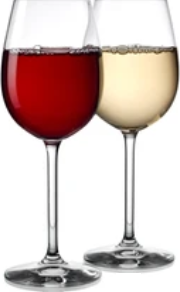

# Multiclass Classification of wine quality

The quality of the wine is an indicator of the true taste of the wine, which mainly depends on its chemical composition.
In this project, two datasets on red and white wine samples are analyzed. The quality of wine is judged by wine tasters, and the aim of the prediction here is to achieve an equal score based on the measured chemical values.

## Background: 
A crucial step in any reputable business is quality control, and excellent production depends on appropriate and precise quality control that can verify the products' function, dimensions, composition, etc.
One of the desired quality control methods might be non-destructive measurement, e.g. Raman spectrometers, which allows the content of a material to be measured without damaging the product. For example, such a device can analyze a liquid in a closed bottle without opening it. However, such an analysis is not sufficient to assess the quality of a bottle of wine, for example, from a human point of view or in terms of taste. Therefore, this analysis must be followed by a calculation algorithm that uses the results of the measurements and calculates the quality of the material. This task could also be solved by machine learning and a well-trained classifier.

## Keywords: 
Python, machine learning, Multiclasse classification, RandomForestclassifier.

## Data Files:	
In this work, we analyze the two available datasets “winequality-red.csv” and “winequality-white.csv” available from:
https://archive.ics.uci.edu/ml/machine-learning-databases/wine-quality/

The winequality-names.txt file contains relevant information about the two datasets related to red and white variants of the Portuguese wine "Vinho Verde".

## Features in each dataset:
   1 - fixed acidity 
   2 - volatile acidity 
   3 - citric acid 
   4 - residual sugar 
   5 - chlorides 
   6 - free sulfur dioxide 
   7 - total sulfur dioxide 
   8 - density 
   9 - pH 
   10 - sulphates 
   11 - alcohol 
   And the output variable (given by the wine tasters): 
   12 - quality (score between 0 and 10)

## Relevant Paper: 
P. Cortez, A. Cerdeira, F. Almeida, T. Matos and J. Reis. Modeling wine preferences by data mining from physicochemical properties. In Decision Support Systems, Elsevier, 47(4):547-553, 2009.

## Methodology:
A machie-learning model for such tasks could be a classifier or a regresser one, because the quality or classes results from metric scale measurements. Therefore, five models were tested: 
   1 - LinearRegression 
   2 - RandomForestRegressor 
   3 - LogisticRegression 
   4 - RandomForestClassifier 
   5 - artificial neural network (ANN) 
In addition to these models, the classes were balanced and the principal component analyzed. Then, the Hyperparameters of the best model, RandomForestClassifier, were finetuned using GridSearchCV in order to get good predictive accuracy, and the resulting model "opt_model.p" was saved under pickle format for quality predtion of other file.

## Code: 
the Python code is given in this repository under the form of Jupyter Notebooks and full script.
The Code is actually divided into three parts: 
     1- "Wine quality EDA.py" the data is analyzed within the framework of Exploratory Data Analysis. 
     2- "Wine quality models.py" different prediction models are trained and then compared with each other. The best model hyperparameters are fine-tuned and stored for later quality prediction of other data. 
     3- "Wine quality prediction.py" The best model is used to predict the quality of new data.

## Results: 
	Muticlass classification accuracy of 64 %
	multiclassifier with tolerance of 1 leads to accuracy of 95%
	multiclassifier with tolerance of 2 leads to accuracy of nearly 100%
